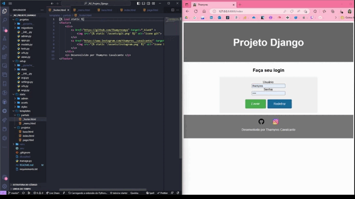

# Projeto Pessoal N2

 

Projeto de desenvolvimento web com Django

 

  <a href="#-tecnologias">Tecnologias</a>&nbsp;&nbsp;&nbsp;|&nbsp;&nbsp;&nbsp;  
  <a href="#-projeto">Projeto</a>&nbsp;&nbsp;&nbsp;|&nbsp;&nbsp;&nbsp;  
  <a href="#-gif">Gif</a>&nbsp;&nbsp;&nbsp;&nbsp;&nbsp;&nbsp;

 

## 🚀 Tecnologias

Esse projeto foi desenvolvido com as seguintes tecnologias:

- Python
- Django
- Git e Github

 

## 💻 Projeto

Projeto pessoal para desenvolver e aprimorar conhecimentos sobre Django.
Utilizei boas práticas coṁ templates, renderizações de página no Django, estruturas partials para evitar duplicação de código.

 

## 📸 Gif
Projeto pessoal

</img>

 

---

Feito com ♥ by Thamyres Cavalcante.

